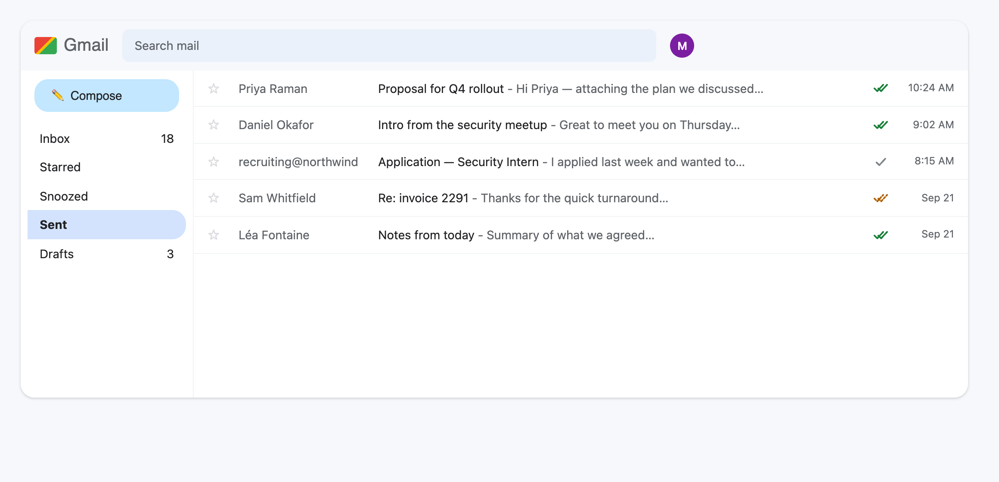
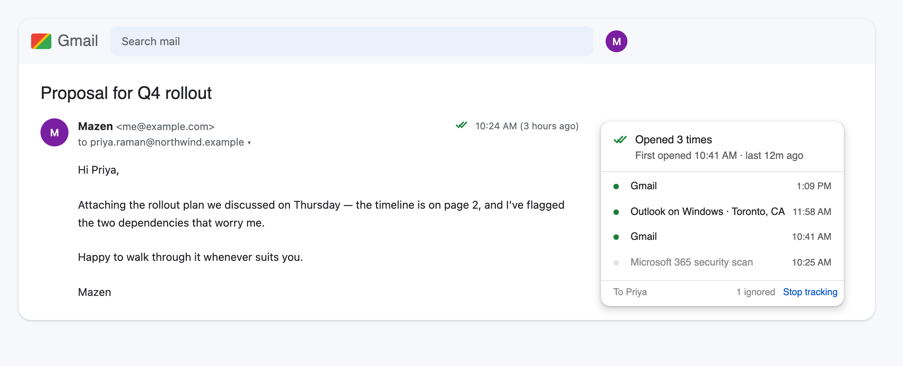
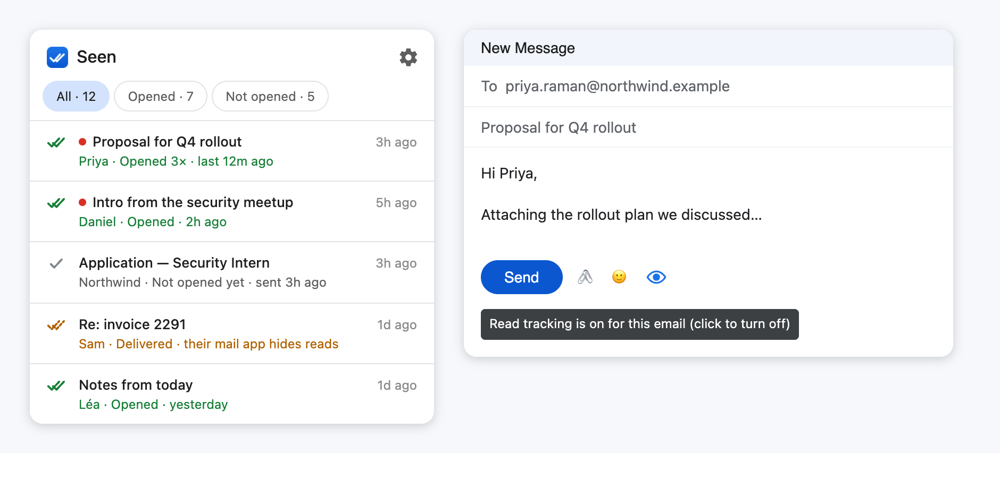

# Seen — read receipts for Gmail

Find out whether the emails you send actually get opened, or are just sitting in someone's inbox.

Seen is a Chrome extension that adds a small check mark to your sent emails in Gmail. Gray means sent. Green means opened. That's the whole idea.



## What you get

**A mark on every email you send.** In your lists and inside conversations. It updates on its own as people open things.



**The story behind each open.** Click the mark and you see when the email was opened, how many times, and what it was opened in — "Gmail", "Outlook on Windows · Toronto, CA". You also see what Seen *ignored*, like a company's automatic security scan, so a number you see is a number you can trust.

**A heads-up when it happens.** A notification, a small note inside Gmail, and a red count on the toolbar icon. The popup lists your recent emails and lets you filter by opened / not opened.



**An off switch.** Every compose window has an eye icon. Click it and that email goes out untracked.

**Honesty when it can't help.** If an email goes out untracked for any reason — plain text, scheduled send, extension not connected — Seen says so right then, instead of leaving you with a mark that never turns green.

## Can I use this?

Yes, but it isn't a one-click install. Seen is two pieces: the Chrome extension, and a small server that *you* own and run. The server is what the invisible tracking image points at, and it's where all your data lives — nobody else's servers are involved, and there's no account to sign up for.

Setting it up takes about five minutes and a free Cloudflare account. It's a few commands:

```sh
pnpm install
pnpm run deploy-server
```

Then load the extension into Chrome. Full instructions: **[docs/SETUP.md](docs/SETUP.md)**.

It works in Chrome, Edge, Brave and Arc, and you can connect more than one browser to the same account.

## How does it know?

Seen puts an invisible image in your email. When the email is opened, that image loads from your server, and your server notes it.

The hard part isn't the image, it's everything *else* that loads it: Gmail preloading it on delivery, Apple Mail fetching it automatically, corporate security scanners opening every link and image before a human ever sees the message, and you rereading your own sent mail. All of that will happily look like an open if nobody checks.

So Seen checks. It recognises the mail scanners, the privacy proxies, the delivery prefetches, and your own views, and it sets them aside rather than counting them. Where a read genuinely can't be confirmed — Apple Mail's privacy protection, for instance — it says "delivered" with an amber mark instead of pretending it knows.

## What it can't do

- **Images off, no receipt.** If your recipient blocks images, nothing loads and nothing is recorded.
- **Your own phone counts as an open.** If you open your sent email on a device without the extension, Seen can't tell that it was you.
- **Group emails.** You learn the email was opened, not which of five people opened it.
- **Microsoft 365 recipients reading in Outlook on the web** may not be counted — those reads look identical to Microsoft's own scanning, and Seen would rather miss one than invent one. Their desktop and phone apps count normally.
- Repeat-open counts are a minimum, since Gmail caches images.

[The full list of what gets counted and what doesn't →](docs/ACCURACY.md)

## Privacy, and the law

Everything Seen records — recipients, subject lines, open events — is stored in your own Cloudflare account and nowhere else. One button in settings deletes all of it. Anything older than a year is deleted automatically.

Tracking pixels are ordinary and widely used, but they aren't unconditionally legal everywhere: in the EU, and in France especially, the recipient's consent is required. Check what applies where you and your recipients are, and use the eye toggle when tracking isn't appropriate.

## More

- **[docs/SETUP.md](docs/SETUP.md)** — installing, updating, running it locally, troubleshooting
- **[docs/ACCURACY.md](docs/ACCURACY.md)** — every case Seen handles, and where it gives up
- **[docs/ARCHITECTURE.md](docs/ARCHITECTURE.md)** — how it's built and why, in detail

MIT licensed. Screenshots above are mock-ups made from the real interface, with sample emails.
